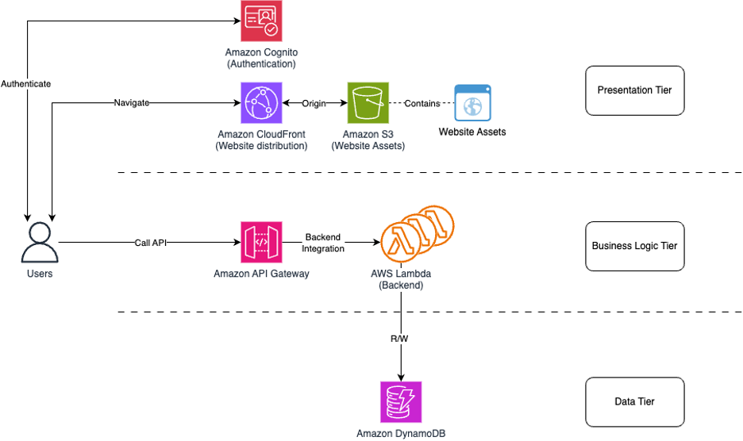
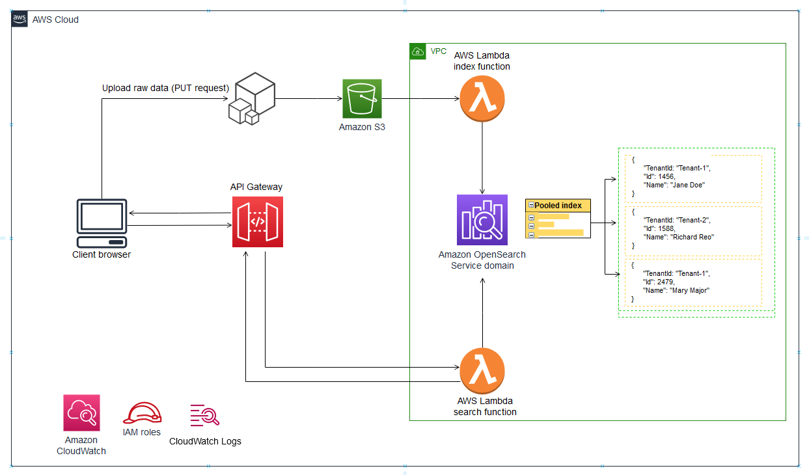
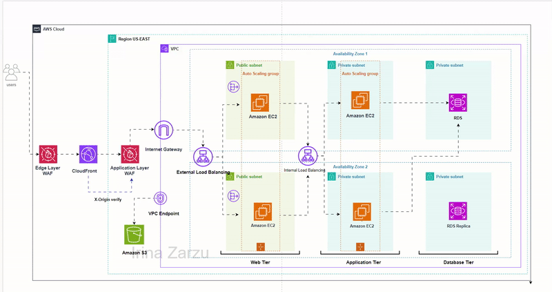

# AWS Cloud Portfolio

This repository contains hands-on AWS cloud projects demonstrating networking, compute, storage, and serverless architectures.

---

## Architecture Overview

---

## Lab Architectures

### VPC + EC2 Infrastructure

### Data Processing Pipeline (S3 + Lambda + OpenSearch)

### Serverless Web Application

### Serverless API (API Gateway + Lambda + DynamoDB)

