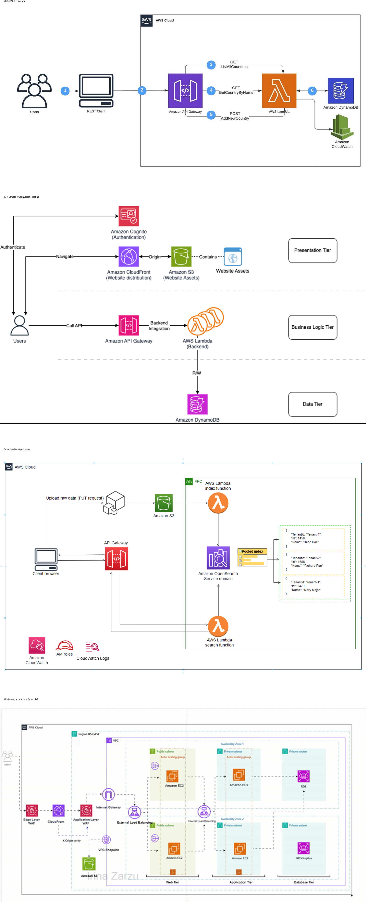

# AWS Cloud Architecture Portfolio
Author: Ahmed O.

This repository contains hands-on AWS cloud architecture projects demonstrating networking, compute, storage, and serverless architectures using Amazon Web Services (AWS).

These projects were built to gain practical experience designing scalable, highly available, and serverless cloud systems similar to real-world production environments.

---

# Architecture Overview

Below is the master architecture diagram representing the AWS services used across the labs in this portfolio.

---

# Projects

## 1. VPC + EC2 High Availability Architecture

Designed a highly available web application environment using Amazon VPC.

Key Components:
- Amazon VPC
- Public and Private Subnets
- Application Load Balancer
- EC2 Instances
- Auto Scaling
- Amazon RDS

Concepts Practiced:
- High availability
- Fault tolerance
- Scalable infrastructure
- Network segmentation

Architecture Pattern:

Internet → Load Balancer → EC2 → RDS

---

## 2. Event-Driven Data Processing Pipeline

Built a serverless data processing pipeline triggered by file uploads.

Architecture:

S3 → Lambda → OpenSearch

Key Services Used:
- Amazon S3
- AWS Lambda
- Amazon OpenSearch
- Amazon CloudWatch
- AWS IAM

Concepts Practiced:
- Event-driven architecture
- Serverless data processing
- Log and search indexing

---

## 3. Serverless Web Application

Developed a fully serverless web application using AWS managed services.

Architecture:

CloudFront → S3 → API Gateway → Lambda → DynamoDB

Key Services Used:
- Amazon CloudFront
- Amazon S3
- Amazon API Gateway
- AWS Lambda
- Amazon DynamoDB

Concepts Practiced:
- Serverless application design
- Content delivery networks
- API-driven architecture

---

## 4. Serverless REST API

Created a scalable REST API using AWS serverless services.

Architecture:

API Gateway → Lambda → DynamoDB

Key Services Used:
- Amazon API Gateway
- AWS Lambda
- Amazon DynamoDB
- Amazon CloudWatch

Concepts Practiced:
- Microservices architecture
- Serverless backend systems
- API integrations

---

# AWS Services Used

The following AWS services were used across these projects:

- Amazon VPC
- Amazon EC2
- Application Load Balancer
- Auto Scaling
- Amazon RDS
- Amazon S3
- Amazon CloudFront
- Amazon API Gateway
- AWS Lambda
- Amazon DynamoDB
- Amazon OpenSearch
- Amazon CloudWatch
- AWS IAM

---

# Repository Structure

aws-cloud-portfolio

├── diagrams  
│   ├── aws_portfolio_master_clean.png  
│   ├── aws-cloud-portfolio-architecture.png  
│   ├── aws-cloud-portfolio-architecture2.png  
│   ├── aws-cloud-portfolio-architecture3.png  
│   └── aws-cloud-portfolio-architecture4.png  

├── vpc-architecture  
├── s3-static-website  
├── lambda-serverless-api  

└── README.md

---

# Author

Ahmed O.  
AWS Cloud Architecture Portfolio
